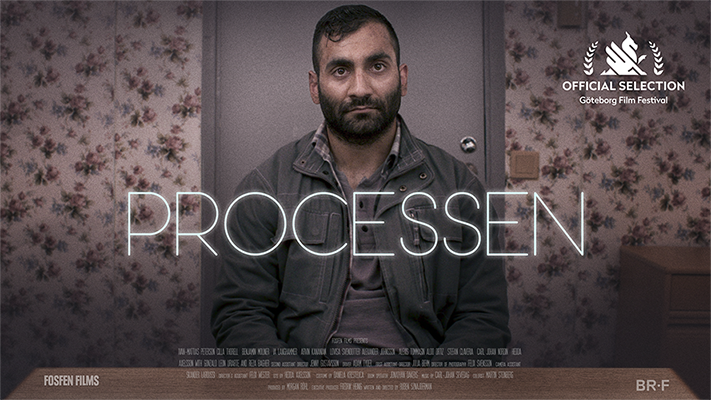

# Processen [SCREENPLAY] :clapper: :movie_camera: :page_with_curl:



## About
This is the repository for the open source screenplay of a short film with the working title *Processen* (The Process).

### Short tagline

The Process is a short film were we follow a legal proceeding were common citizens are confronted with what they wrote on social media long time ago. 

### Watch
Here is a link to the finished film:
[https://www.youtube.com/watch?v=kOqCaiW6QCs](https://www.youtube.com/watch?v=kOqCaiW6QCs)

### Read the script :page_facing_up:

The latest version of the script can be downloaded as an PDF from [here](https://www.dropbox.com/sh/nm2q55o5mxwn9jf/AACaMxhRMDqwZuvTJfEpv1Y0a?dl=0).

### Project status
Update: 2019-02-05 - This short film has been produced and premiered at the Göteborg Film Festival on 26th of Februari 2019.

### N00bs :dizzy_face:

If you come from filmmaking and don’t know anything about git, repositories, and is wondering what a the heck a screenplay is doing on platform for programmers, feel free to read [this](https://medium.freecodecamp.org/what-is-git-and-how-to-use-it-c341b049ae61).

### Credits

* **Ruben Sznajderman** - [*Initial work*](https://www.dropbox.com/s/llgxtyayhm89ssx/processen_scan.pdf?dl=0) 
* **Ludvig Geijer Michaeli** - *Transcribing the 1st draft*
 
### Contribute

The story and first draft was written by [rubensz](https://github.com/rubensz), who is also maintaining this repository during development, but anybody is welcome to clone the script for the purpose of tinkering, edit, correct, comment, improve and push the “code” back to the repository – just like with open source software.

Please read [CONTRIBUTING.md](https://gist.github.com/PurpleBooth/b24679402957c63ec426) for details on submitting pull requests to the head writer.

### Versioning

We use [SemVer](http://semver.org/) for versioning as a source of inspiration for best practice. I hope create a versioning scheme for screenplays in the future.

### Prerequisites

##### Fountain Syntax

This script is written in a Fountain which is a plain text markdown language for screenplays. As long as you follow the Fountain Syntax, you can edit the screenplay in any editor for plain text – although software dedicated to Fountain syntax (or one with a plugin for Fountain), gives a superior writing experience. To see some options, see this [link](https://fountain.io/apps).

##### Git

Git is software for version control. Follow [these instructions](https://gist.github.com/derhuerst/1b15ff4652a867391f03) on how to install Git on OS X, Windows and Linux

### Cloning

```
git clone https://github.com/rubensz/processen.git
```

### License

This project is licensed under the Creative Commons Attribution 4.0 International
 - see the [LICENSE.md](LICENSE.md) file for details.


#### Built With
* [Pilot](https://www.jetpens.com/Pilot-Metropolitan-Fountain-Pens/ct/1706) - First draft was written with Pen. Yes, actual pen that you hold in your hand! :black_nib:
* [Fountain Syntax](https://fountain.io/syntax) - Plain text markup language for screenplays.
* [Vim](https://www.vim.org/download.php) - Vim is a modal text editor.
* [Fountain.vim](https://www.vim.org/scripts/script.php?script_id=3880) - Syntax files that adds support for Fountain in Vim.
* [Afterwriting](https://github.com/ifrost/afterwriting-labs/blob/master/docs/clients.md) - Terminal application that converts fountain files to PDF.

## Acknowledgments

#### From Ruben Sznajderman

* Big thanks to Manusgruppen (Writer's group, Stockholm chapter).


###### Research by initial author

1. [Stasiland: Stories from Behind the Berlin Wall by Anna Funder.](https://www.goodreads.com/book/show/226369.Stasiland)
2. [A Comparative Study of Government Surveillance of Social Media and Mobile Phone Communications during Iran’s Green Movement (2009) and the UK Riots (2011).](https://triple-c.at/index.php/tripleC/article/view/655)
3. [Oppressive regimes step up high-tech censorship](https://ijnet.org/en/story/oppressive-regimes-step-high-tech-censorship-world-press-freedom-day)
4. [Monitoring Social Media - Lessons for Future Department of Defense Social Media Analysis in Support of Information Operations.](https://www.rand.org/pubs/research_reports/RR1742.html)
5. [Oppression for Pennies – The Cost of Surveillance is Falling.](https://www.privateinternetaccess.com/blog/2018/07/oppression-for-pennies-the-cost-of-surveillance-is-falling/)
6. [Internet monitoring in the Gulf - We're watching you.](https://www.economist.com/pomegranate/2014/07/16/were-watching-you)
7. [In Repressive Countries, Citizens Go 'Dark' to Share Independent News](https://www.cima.ned.org/publication/repressive-countries-citizens-go-dark-share-independent-news/)
8. [Allmän ordning.](https://sv.wikipedia.org/wiki/Allm%C3%A4n_ordning)
9. [Förledande av ungdom.](https://sv.wikipedia.org/wiki/F%C3%B6rledande_av_ungdom)
10. [Förargelseväckande beteende.](https://sv.wikipedia.org/wiki/F%C3%B6rargelsev%C3%A4ckande_beteende)
11. [Allmän sammankomst.](https://sv.wikipedia.org/wiki/Allm%C3%A4n_sammankomst)
12. [Ordningslagen (Sverige).](https://sv.wikipedia.org/wiki/Ordningslagen_(Sverige))
13. [Förargelseväckande beteende.](https://sv.wikipedia.org/wiki/F%C3%B6rargelsev%C3%A4ckande_beteende)
14. [Juridisk ordlista.](http://www.domstol.se/Juridisk-ordlista/?pId=11699)
